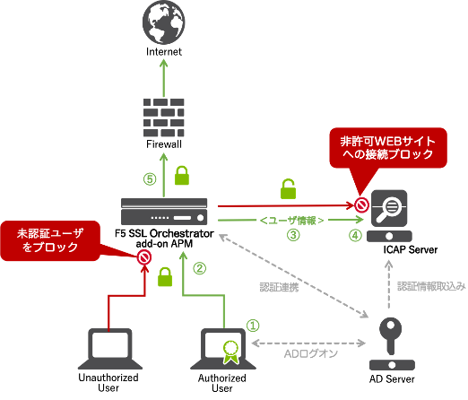

F5 SSLOとi-FILTER ICAP版連携の流れ
======================================

F5 SSLOとi-FILTER　ICAP版の連携の流れは以下の通りです。

#. クライアントがパソコン(AD)にログオンします。 
#. SSLOでユーザ認証を実施し(NTLM認証、Kerberos認証の場合は自動的に認証が実施されます)、SSL通信を復号します。
#. WEB接続先情報とSSLOで認証が成功したユーザ情報を i-FILTERにICAPで送ります。
#. ユーザ情報を元にURLフィルタリングルールを適用し、接続が許可されていないWEBサイトの場合は、ブロック画面をクライアントに表示します。
#. 許可された通信に関しては、SSL 通信を再暗号化し、WEBサーバへ接続します。
