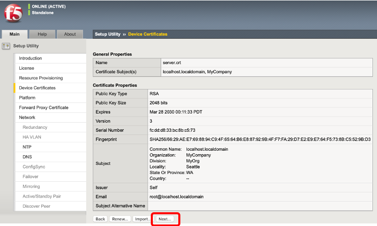
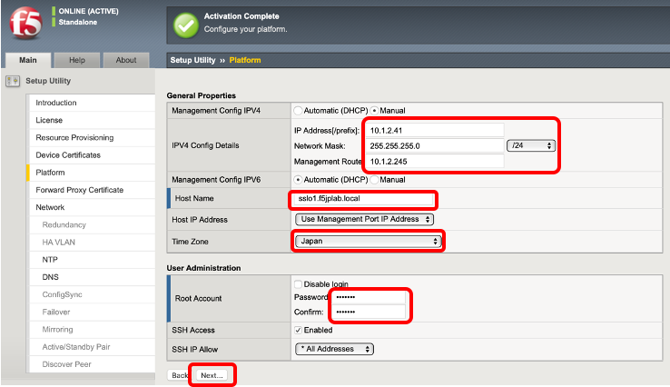

ライセンスアクティベーション、プロビジョニング、CA証明書/鍵登録
=========================================================

#. 次へボタンを押します。

.. figure:: images/mod3-1.png
   :scale: 100%
   :align: left

#. ライセンスをアクティベーションします。

#. 以下のモジュールをプロビジョニングします。
　    SSLO（SSL可視化）：LTM、AVR、iRulesLX、SSLO
　    APM（認証）：APM

.. figure:: images/mod3-2.png
   :scale: 100%
   :align: left

#. Nextボタンを押します。

#. ホスト名、タイムゾーン、Rootパスワードを設定して、Nextボタンを押します。

#. SSLOでサーバ証明書を書き換える際に利用するCA証明書、CA鍵を選択し、任意の名前を設定し、Nextボタンを押します。

.. figure:: images/mod3-5.png
   :scale: 60%
   :align: left

#. Finishedボタンを押します。

.. figure:: images/mod3-6.png
   :scale: 60%
   :align: left

