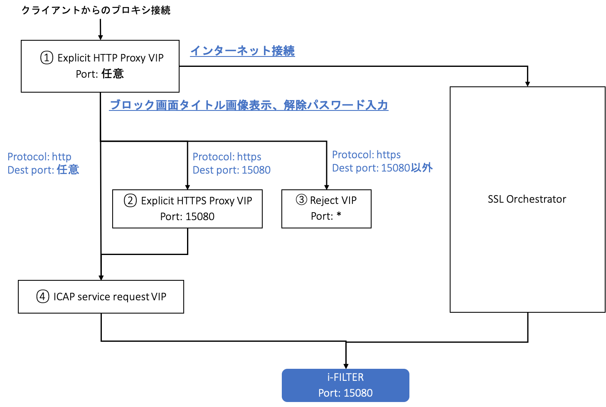

i-FILTERブロック画面のタイトル画像の表示、パスワードブロック解除の設定
====================================================================

　10.3章にて、SSLO連携をするとブロック画面のタイトルが標準では表示されないと記載しましたが、以下の設定を追加することによって、表示させることが可能です。本設定を行うことにより、パスワード入力によるブロック解除も連携が可能となります。上記を実現するためには、下図の4つのVirtual Serverが追加で必要となります。ここでは、下図の④②①③の順で作成していきます。

|  

ICAP service request用Virtual Serverの作成
--------------------------------------------

#. まずはICAP用のプロファイルを以下のように作成します。 **Local Traffic >> Profiles >> Services >> ICAP** にて、:guilabel:`Create` ボタンを押します。**任意の名前** を入力し、**URI** には以下のように入力し、:guilabel:`Finished` ボタンを押します。
    
    **icap://${SERVER_IP}:${SERVER_PORT}/REQMOD**

    .. image:: images/mod13-2.png
    | 
#. 次にICAP service request 用のVirtual Serverを作成します。**Local Traffic >> Virtual Servers** にて、:guilabel:`Create` ボタンを押します。**任意の名前** を入力し、**Type** は **Internal** を選択します。

    .. image:: images/mod13-3.png
    | 
#. **Configuration** にて **Advanced** を選択し、**ICAP Profile** にて、作成済みの **ICAPプロファイル** を選択します。

    .. image:: images/mod13-4.png
    | 
#. 最後に、**Default Pool** にて、SSLO Guided Configurationで作成済みの **Pool** を選択して、:guilabel:`Finished` ボタンを押します。

    .. image:: images/mod13-5.png
    | 

Transparent Proxy用Virtual Serverの作成
--------------------------------------------

#. まず、ICAP用のVirtual Serverを呼び出すためのRequest Adaptプロファイルを作成します。**Local Traffic >> Profiles >> Services >> Request Adapt** にて、:guilabel:`Create` ボタンを押します。**任意の名前** を入力し、**Internal Virtual Name** にて、作成済みの **Virtual Sever** を選択し、**Preview Size** にて、**0** を入力し、:guilabel:`Finished` ボタンを押します。

    .. image:: images/mod13-6.png
    |
#. 次に、SSLサイトにおけるブロック時に、ブロック画面内のタイトル画像にSSL接続するためのClientSSLプロファイルを作成します。**Local Traffic >> Profiles >> SSL >> Client** にて、:guilabel:`Create` ボタンを押します。**任意の名前** を入力し、タイトル画像をSSL経由で表示させるための **サーバ証明書** と **秘密鍵** を選択し、:guilabel:`Finished` ボタンを押します。（BIG-IPにてSSLオフロードを行うため、**System >> Certificate Management >> Traffic Certificate Management** にて、予め **サーバ証明書** と **秘密鍵** の登録が必要となります。）

    .. image:: images/mod13-7.png
    |  
#. 次に、Proxy用のTunnelを作成します。**Network >> Tunnel List** にて、:guilabel:`Create` ボタンを押します。**任意の名前** を入力し、**Profile** にて、**tcp-forward** を選択し、:guilabel:`Finished` ボタンを押します。

    .. image:: images/mod13-8.png
    |  
#. 次に、HTTPSトラフィックにおけるURI書き換え用のiRuleを作成します。**Local Traffic >> iRules** にて、:guilabel:`Create` ボタンを押します。 **任意の名前** を入力して、 **Definition** に以下サンプル **iRule** を入力し、:guilabel:`Finished` ボタンを押します。（以下のiRuleはあくまでもサンプルとなります。同じ主旨の内容であれば下記と同じでなくても構いません。）
    例）URI書き換え用のiRule

    .. code-block:: bash

            ###  Add this iRule to Transparent Virtual Server ###
            when HTTP_REQUEST {
                set OLDURI [HTTP::uri]
                HTTP::uri "https://[HTTP::host]$OLDURI"
            }

#. 次に、SSL用のTransparent Virtual Serverを作成します。**Local Traffic >> Virtual Servers** にて、:guilabel:`Create` ボタンを押します。**任意の名前** を入力し、**Destination Address/Mask** にて、**0.0.0.0/0** を入力、**Service Port** にて、**15080** と入力します。

    .. image:: images/mod13-9.png
    |  
#. **Configuration** にて、**Advanced** を選択し、**HTTP Profile** にて、**http** を選択、**SSL Profile (Client)** にて、作成済みの **clientsslプロファイル** を選択します。

    .. image:: images/mod13-10.png
    |  
#. **Request Adapt Profile** にて、作成済みの **プロファイル** を選択し、**VLAN and Tunnel Traffic** にて、**Enable on...** を選択し、**VLANs and Tunnels** にて作成済みの **Tunnel** を選択し、**Source Address Translation** にて **Auto Map** を選択し、**Address Translation** と **Port Translation** のチェックをはずします。

    .. image:: images/mod13-11.png
    |  
#. **iRules** にて、作成済みの **iRule** を選択し、:guilabel:`Finished` ボタンを押します。

    .. image:: images/mod13-12.png
    |  

Explicit Proxy用Virtual Serverの作成
--------------------------------------------

#. まず、プロキシ用のExplicit Profileを作成します。**Local Traffic >> Profiles >> Services >> HTTP** にて、:guilabel:`Create` ボタンを押します。**Proxy Mode** にて、**Explicit** を選択します。

    .. image:: images/mod13-13.png
    | 
#. **DNS Resolver** にて、SSLO Guided Configurationで作成した **DNS Resolver** を選択し、**Tunnel Name** にて、作成済みの **Tunnel** を選択し、:guilabel:`Finished` ボタンを押します。

    .. image:: images/mod13-14.png
    |  
#. 次に、以下の２つのiRuleを作成します。
    * インターネット接続用のHTTP/HTTPsトラフィックとi-FILTERブロックタイトル画面接続トラフィックを分けるiRule
    * 上記後者のトラフィックにおいて、i-FILTER向けにURIを書き換えるiRule
 
    **Local Traffic >> iRules** にて、:guilabel:`Create` ボタンを押します。**任意の名前** を入力して、**Definition** に以下サンプル **iRule** を入力し、:guilabel:`Finished` ボタンを押します。本iRuleでは、トラフィックの内容をみて、ICAPプロファイルを紐付けるかの判断もしています。また、iRule内のホスト名は、環境にあわせたFQDN/IPアドレスに変更して頂く必要があります。
    （以下のiRuleはあくまでもサンプルとなります。同じ主旨の内容であれば下記と同じでなくても構いません。また、以下の２つのiRuleは、1つのファイルにしていただいても構いません。）
      
    例）トラフィックを分ける用のiRule

    .. code-block:: bash

            ###  Add this iRule to Explicit Virtual Server ###
            when HTTP_PROXY_REQUEST {
                set F5PROXY "bigip.f5jplab.local"
                if { [HTTP::host] contains $F5PROXY} {
                    HTTP::proxy enable
                    ADAPT::enable request false
                } else {
                    HTTP::proxy disable
                    virtual sslo_L3ExplicitProxy.app/sslo_L3ExplicitProxy-xp-4
                    snat automap
                }        
            }
    例）URI書き換え用のiRule

    .. code-block:: bash

        ###  Add this iRule to Explicit Virtual Server ###
        when HTTP_REQUEST {
            set F5PROXY "bigip.f5jplab.local"
            if { [HTTP::host] contains $F5PROXY} {
                set OLDURI [HTTP::uri]
                HTTP::uri "http://[HTTP::host]$OLDURI" 
                ADAPT::enable request true
            } else {
                ADAPT::enable request false
            }
        }

#. 次にExplicit Proxy用のVirtual Serverを作成します。**Local Traffic >> Virtual Servers** にて、:guilabel:`Create` ボタンを押します。**任意の名前** を入力し、**Destination Address/Mask** にて、プロキシ接続用の **IPアドレス** を入力、**Service Port** にて、プロキシとして利用する **ポート番号** を入力します。

    .. image:: images/mod13-15.png
    |  
#. **HTTP Profile(Client)** にて、作成済みの **HTTP Explicit Profile** を選択します。

    .. image:: images/mod13-16.png
    |  
#. **Request Adapt Profile** にて、作成済みのプロファイルを選択し、**Source Address Translation** にて、**Auto Map** を選択します。

    .. image:: images/mod13-17.png
    |  
#. **iRules** にて作成済みの２つのiRuleを選択して、 :guilabel:`Finished` ボタンを押します。

    .. image:: images/mod13-18.png
    |  
  
Reject用Virtual Serverの作成
-----------------------------------

#. 最後に、**15080ポート以外はブロック** をするVirtual Serverを作成します。（本Virtual Serverがなくても動作はします。） **任意の名前** を入力し、**Type** にて **Reject** を選択し、**Destination Address/Mask** にて、**0.0.0.0/0** と入力し、**Service Port** にて * と入力します。**VLAN and Tunnel Traffic**にて、**Enabled on...** を選択し、**VLANs and Tunnels** にて作成済みのTunnelを選択し、:guilabel:`Finished` ボタンを押します。

    .. image:: images/mod13-19.png
    |  

i-FILTER側の設定
-----------------------------------

#. **システム／システムパラメーター／機能設定** にて、**仮想ホスト転送モード** を有効にし、**コンテンツ転送用アドレス** に **BIG-IPのFQDN** を入力し、**ポート番号** に **15080** を入力します。（IPアドレスを入力しても動作はしますが、SSL接続時にブラウザでプライバシー保護のエラーが表示されます。）

    .. image:: images/mod13-20.png
    |  
#. **システム／システムパラメーター／動作設定** にて、**コンテンツ転送**、**ブロック解除** のそれぞれに **任意の値** を設定します。（ブロック画面タイトル表示時、パスワードブロック解除時のURIの一部として利用されます。）

    .. image:: images/mod13-21.png
    |  

クライアントからの接続テスト
-----------------------------------

#. ブラウザの **プロキシ設定** にて、作成済みのExplicit ProxyのIPアドレスに紐づく **FQDN** または、IPアドレスに変更します。
    |  
#. ブラックリストの宛先への通信がブロックされ、タイトル画像が表示されることを確認します。

    .. image:: images/mod13-22.png
    |  
#. パスワードブロック解除が設定されている宛先へ接続し、パスワード入力画面が表示されることを確認します。

    .. image:: images/mod13-23.png
    |  
#. 解除パスワード入力後、無事WEB接続ができる事を確認します。

    .. image:: images/mod13-24.png
    |  

