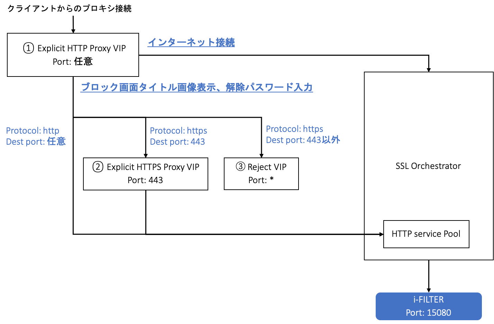

i-FILTERブロック画面のタイトル画像の表示、パスワードブロック解除の設定
====================================================================

2.11.3にて、SSLO連携をするとブロック画面のタイトルが標準では表示されないと記載しましたが、以下の設定を追加することによって、表示させることが可能です。本設定を行うことにより、パスワード入力によるブロック解除も連携が可能となります。上記を実現するためには、下図の3つのVirtual Serverが追加で必要となります。ここでは、下図の①②③の順で作成していきます。

Explicit HTTP Proxy用Virtual Serverの作成
--------------------------------------------

#. Proxy用のTunnelを作成します。**Network >> Tunnel List** にて、:guilabel:`Create` ボタンを押します。任意の名前 を入力し、Profile にて、tcp-forward を選択し、:guilabel:`Finished` ボタンを押します。

    .. image:: images/mod13-2.png
    |  
#. プロキシ用のExplicit Profileを作成します。**Local Traffic >> Profiles >> Services >> HTTP** にて、:guilabel:`Create` ボタンを押します。任意の名前を設定し、**Proxy Mode** にて、**Explicit** を選択します。

    .. image:: images/mod13-3.png
    |  
#. **DNS Resolver** にて、SSLO Guided Configurationで作成した **DNS Resolver** を選択し、**Tunnel Name** にて、作成済みの **Tunnel** を選択し、:guilabel:`Finished` ボタンを押します。

    .. image:: images/mod13-4.png
    |  
#. 次に、以下の２つのiRuleを作成します。

  * インターネット接続用のHTTP/HTTPsトラフィックとi-FILTERブロックタイトル画面接続トラフィックを分けるiRule
  * 上記後者のトラフィックにおいて、i-FILTER向けにヘッダーを追加するiRule

  1つ目のiRuleでは、ホスト名でインターネット接続トラフィックと判断した場合、SSLOのExplicit用のVirtual Sererに転送します。2つ目のiRuleでは、ホスト名でi-FILTER宛の通信と判断した場合、ヘッダーを追記して、i-FILTER用のPoolに転送します。各iRule内のホスト名は、環境にあわせたFQDN/IPアドレスに変更して頂く必要があります。
  
  **Local Traffic >> iRules** にて、:guilabel:`Create` ボタンを押します。**任意の名前** を入力して、**Definition** に以下サンプルiRuleを入力し、:guilabel:`Finished` ボタンを押します。（以下のiRuleはあくまでもサンプルとなります。同じ主旨の内容であれば下記と同じでなくても構いません。また、以下の２つのiRuleは、1つのファイルにしていただいても構いません。）
 
  例）トラフィックを分ける用のiRule

    .. code-block:: bash

            ##  Add this iRule to Explicit HTTP Proxy Virtual Server  ##
            when HTTP_PROXY_REQUEST {
                set F5PROXY "bigip.f5jplab.local”   # For block jpg
                set F5PROXY2 "10.100.35.221”        # For password bypass
                if { [HTTP::host] contains $F5PROXY || [HTTP::host] contains $F5PROXY2 }  {
                    HTTP::proxy enable
                } else {
                    HTTP::proxy disable
                    virtual sslo_L3ExplicitProxy.app/sslo_L3ExplicitProxy-xp-4
                    snat automap
                } 
            }

  例）ヘッダー追加用のiRule

      .. code-block:: bash

            ##  Add this iRule to Explicit HTTP Proxy Virtual Server  ##
            when HTTP_REQUEST {
                set F5PROXY "bigip.f5jplab.local” # For block jpg
                set F5PROXY2 "10.100.35.221”      # For password bypass
                if { [HTTP::host] contains $F5PROXY || [HTTP::host] contains $F5PROXY2 } {
                    if { [HTTP::method] ne "CONNECT" } {
                        HTTP::header replace "X-Forwarded-Proto" "http"
                        pool ssloS_iFILTERProxy.app/ssloS_iFILTERProxy
                    }
                }
            }

#. Explicit Proxy用のVirtual Serverを作成します。**Local Traffic >> Virtual Servers** にて、:guilabel:`Create` ボタンを押します。**任意の名前** を入力し、**Destination Address/Mask** にて、プロキシ接続用の **IPアドレス** を入力、**Service Port** にて、プロキシとして利用する **ポート番号** を入力します。

    .. image:: images/mod13-5.png
    |  
#. **HTTP Profile(Client)** にて、作成済みの **HTTP Explicit Profile** を選択します。

    .. image:: images/mod13-6.png
    |  
#. **Source Address Translation** にて、**Auto Map** を選択します。

    .. image:: images/mod13-7.png
    |  
#. **iRules** にて作成済みの２つのiRuleを選択して、:guilabel:`Finished` ボタンを押します。

    .. image:: images/mod13-8.png
    |  

Explicit HTTPS Proxy用Virtul Serverの作成
--------------------------------------------

#. HTTPSトラフィックにおけるi-FILTER向けヘッダ追加用のiRuleを作成します。このiRuleでは、ヘッダーを追記して、i-FILTER用のPoolに転送します。 **Local Traffic >> iRules** にて、:guilabel:`Create` ボタンを押します。 **任意の名前** を入力して、 Definition に以下サンプル **iRule** を入力し、:guilabel:`Finished` ボタンを押します。（以下のiRuleはあくまでもサンプルとなります。同じ主旨の内容であれば下記と同じでなくても構いません。）

  例）ヘッダー追加用のiRule

    .. code-block:: bash

            ### Add this iRule to Explicit HTTPs Proxy Virtual Server ###
            when HTTP_REQUEST {
                HTTP::header replace "X-Forwarded-Proto" "https"
                pool ssloS_iFILTERProxy.app/ssloS_iFILTERProxy
            }

#. ブロック画面内のタイトル画像にSSL接続するためにBIG-IPにてSSLオフロードを行うため、**サーバ証明書** と **秘密鍵** の登録します。 **System >> Certificate Management >> Traffic Certificate Management** にて、**利用するサーバ証明書** と **秘密鍵** の登録します。下記が登録したサーバ証明書のイメージです。ここでは、SANにFQDNとIPアドレスを登録しています。

    .. image:: images/mod13-9.png
    |  
#. 次に、SSLサイトにおけるブロック時に、ブロック画面内のタイトル画像にSSL接続するためのClientSSLプロファイルを作成します。**Local Traffic >> Profiles >> SSL >> Client** にて、:guilabel:`Create` ボタンを押します。**任意の名前** を入力し、先程登録した **サーバ証明書** と **秘密鍵** を選択し、:guilabel:`Finished` ボタンを押します。

    .. image:: images/mod13-10.png
    |  
#. HTTPS用のExplicit Proxy Virtual Serverを作成します。**Local Traffic >> Virtual Servers** にて、:guilabel:`Create` ボタンを押します。**任意の名前** を入力し、**Destination Address/Mask** にて、**0.0.0.0/0** を入力、**Service Port** にて、**443** と入力します。

    .. image:: images/mod13-11.png
    |  
#. **Configuration** にて、**Advanced** を選択し、**HTTP Profile** にて、**http** を選択、**SSL Profile (Client)** にて、作成済みの **clientsslプロファイル** を選択します。

    .. image:: images/mod13-12.png
    |  
#. **VLAN and Tunnel Traffic** にて、**Enable on...** を選択し、**VLANs and Tunnels** にて作成済みの **Tunnel** を選択します。

    .. image:: images/mod13-13.png
    |  
#. **iRules** にて、作成済みの **iRule** を選択し、:guilabel:`Finished` ボタンを押します

    .. image:: images/mod13-14.png
    |  

Reject用Virtual Serverの作成
--------------------------------------------

#. 最後に、443ポート以外はブロックをするVirtual Serverを作成します。（本Virtual Serverがなくても動作はします。）任意の名前を入力し、**Type** にて **Reject** を選択し、**Destination Address/Mask** にて、**0.0.0.0/0** と入力し、**Service Port** にて * と入力します。**VLAN and Tunnel Traffic** にて、**Enabled on...** を選択し、**VLANs and Tunnels** にて作成済みの **Tunnel** を選択し、:guilabel:`Finished` ボタンを押します。

    .. image:: images/mod13-15.png
    |  

i-FILTER側の設定
--------------------------------------------

#. **システム／システムパラメーター／動作設定** にて、**コンテンツ転送** 、**ブロック解除** のそれぞれにサーバ証明書に登録したDNS名を設定します。（ブロック画面タイトル表示時、パスワードブロック解除時のURIの一部として利用されます。）

    .. image:: images/mod13-16.png
    |  

クライアントからの接続テスト
--------------------------------------------

#. ブラウザの プロキシ設定 にて、作成済みのExplicit ProxyのIPアドレスに紐づく **FQDN** または、**IPアドレス** に変更します。

#. ブラックリストの宛先への通信がブロックされ、タイトル画像が表示されることを確認します。

    .. image:: images/mod13-17.png
       :scale: 60%
       :align: center
    |  
#. パスワードブロック解除が設定されているURLへ接続し、パスワード入力画面が表示されることを確認します。

    .. image:: images/mod13-18.png
       :scale: 60%
       :align: center
    |  
#. 解除パスワード入力後、無事WEB接続ができる事を確認します。

    .. image:: images/mod13-19.png
       :scale: 60%
       :align: center
    |  

